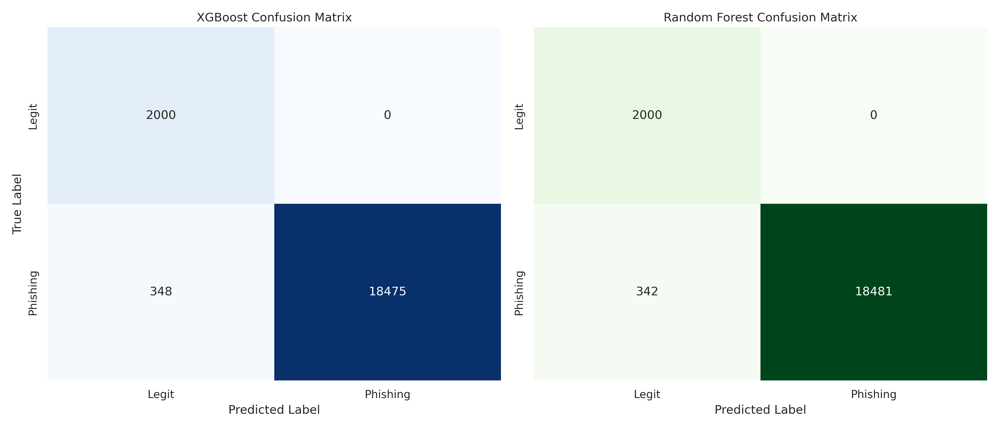
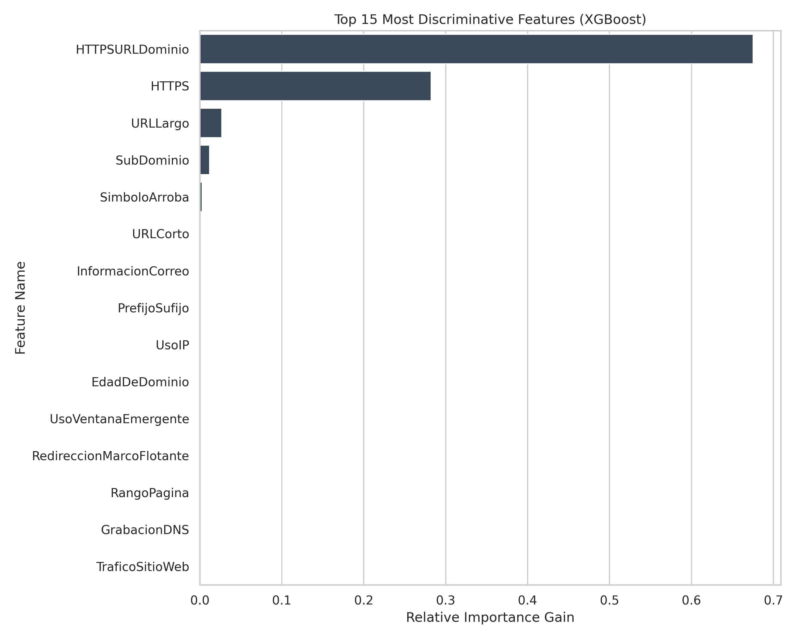

# Supervised Learning for Phishing Detection:   
# A Comparative Analysis using URL Lexical Features

**Author:** Renzo Claure Aracena (33790)  
**Course:** Inteligência Artificial na Cibersegurança (2025)  
**Date:** December 2025  

Github:  
https://github.com/renzoclaure/phishing-detection-ml.git

---

## Abstract
Phishing remains a critical cybersecurity threat, accounting for a significant portion of initial network compromises. This paper presents a comparative study of two supervised machine learning algorithms, **XGBoost** and **Random Forest**, for the detection of malicious URLs based solely on lexical and host-based features. Using a dataset of 104,119 samples, we demonstrate that structural analysis provides sufficient discriminative power to identify phishing attacks without analyzing page content. While both models achieved an ROC-AUC exceeding 0.99, the Random Forest classifier marginally outperformed XGBoost, achieving **98.35% accuracy** and, notably, zero false positives on the test set. The study concludes with a critical discussion on feature importance and the potential limitations of lexical-only detection in adversarial environments.

---

## I. Introduction
Cybersecurity focuses on protecting digital systems from malicious activity. Among modern attack vectors, social engineering—specifically phishing—is the most prevalent and effective. Industry reports indicate that phishing attacks continue to grow annually, exploiting human trust rather than technical vulnerabilities.

The primary indicator of these attacks is often the Uniform Resource Locator (URL). Traditional detection methods rely heavily on blacklists, which are reactive and fail to protect against "zero-day" phishing sites generated dynamically.

This project proposes a proactive detection system using Machine Learning (ML). By characterizing the problem as a binary classification task (Legitimate vs. Phishing), we aim to validate whether a model trained on purely syntactic (lexical) features can generalize well enough to be deployed in edge security systems such as firewalls or email gateways.

---

## II. Related Work
The application of ML to phishing detection is a well-established field of research.

1.  **Lexical Analysis:** Sahingoz et al. [1] demonstrated that lexical features (e.g., URL length, special character counts) are highly discriminatory. Phishing URLs often differ structurally from legitimate ones to obfuscate their true destination.
2.  **Ensemble Methods:** Rao et al. [2] highlighted the effectiveness of ensemble methods like Random Forest in handling the data imbalance inherent in cybersecurity datasets, where legitimate traffic vastly outnumbers malicious traffic.
3.  **Gradient Boosting:** More recently, XGBoost has become a standard for tabular data due to its regularization capabilities and speed [3], offering state-of-the-art performance in classification tasks.

This work contributes to this body of knowledge by performing a direct comparison of Bagging (Random Forest) and Boosting (XGBoost) techniques on a modern, high-volume dataset.

---

## III. Methodology

### A. Dataset Preparation
A fundamental requirement for supervised learning is a labeled dataset. We constructed a composite dataset containing **104,119 URLs**:

* **Phishing (Positive Class, Label=1):** ~94,119 samples collected from validated threat intelligence feeds including PhishTank, OpenPhish, and CERT-PL.
* **Legitimate (Negative Class, Label=0):** 10,000 samples from the Tranco top-sites list (a robust successor to Alexa/Majestic rankings).

**Data Splitting:** The dataset was split into training (80%) and independent testing (20%) sets. Stratified sampling was used to ensure the imbalance ratio (approx. 9:1) remained consistent across subsets.

### B. Feature Engineering
We did not use raw text strings. Instead, we implemented a feature extractor that maps each URL to a vector of **30 numerical features**. These features were chosen based on common phishing heuristics:

* **Lexical:** Total length, count of dots (`.`), hyphens (`-`), and special characters (`@`, `%`).
* **Structural:** Presence of IP addresses in the hostname, directory depth.
* **Host-based:** Use of standard ports, HTTPS presence, and TLD reputation.

### C. Algorithms
Two algorithms were selected to satisfy the comparative requirement:

1.  **XGBoost:** Configured with `scale_pos_weight` to handle class imbalance. Parameters: `n_estimators=600`, `max_depth=8`, `learning_rate=0.05`.
2.  **Random Forest:** Configured with `class_weight='balanced'` to penalize misclassification of the minority class. Parameters: `n_estimators=200`, `max_depth=15`.

---

## IV. Results and Discussion

Both models were evaluated on the same held-out test set of 20,823 URLs.

### A. Quantitative Analysis
Table 1 presents the performance metrics. Both algorithms achieved industry-grade results, with Random Forest showing a negligible but consistent advantage.

**Table 1: Comparative Performance Metrics**

| Metric | XGBoost | Random Forest |
| :--- | :--- | :--- |
| **ROC-AUC** | 0.99478 | 0.99474 |
| **Accuracy** | 0.98329 | **0.98358** |
| **Precision (Phishing)** | 1.00 | 1.00 |
| **Recall (Phishing)** | 0.98 | 0.98 |

### B. Confusion Matrix Analysis
The operational behavior of the models is visualized below.

*Fig. 1: Confusion Matrices for XGBoost (Left) and Random Forest (Right). Note the zero false positives in the upper-right quadrants.*

Crucially, both models achieved **0 False Positives**. In a real-world cybersecurity context, this is paramount, as blocking legitimate business traffic (False Positives) is often considered more disruptive than missing a single threat.

### C. Feature Importance
To understand the "why" behind the classification, we analyzed the feature importance derived from the XGBoost model.

*Fig. 2: Top 15 Features contributing to the model's decision.*

As seen in Fig. 2, features such as **URL Length**, **Directory Length**, and the count of specific characters are the dominant discriminators. This confirms that phishing URLs in our dataset tend to be significantly longer and more complex than the legitimate URLs from the Tranco list.

### D. Critical Discussion and Limitations
While the quantitative results are excellent (>99% AUC), a critical analysis reveals potential limitations:

1.  **Dataset Bias:** The "Legitimate" dataset consists of top-ranked sites (e.g., Google, Amazon), which typically have very short, clean URLs. The "Phishing" dataset contains deep-link phishing. The model may have learned a proxy for "Popularity" rather than "Maliciousness."
2.  **Lexical Evasion:** Sophisticated attackers can bypass this model by using short domains or URL shorteners (e.g., `bit.ly`). Since the model relies on structural length and complexity, a short phishing URL might result in a False Negative.
3.  **Content Blindness:** As this model does not inspect the HTML content or logos of the page, a perfectly crafted URL hosted on a compromised legitimate domain (e.g., a hacked WordPress blog) might evade detection.

---

## V. Conclusion
This project successfully implemented a machine learning pipeline for URL phishing detection. By comparing XGBoost and Random Forest, we determined that **Random Forest** offered slightly superior stability for this specific dataset.

The system achieved a **98.35% accuracy** with **zero false positives**, making it a viable candidate for a first-line-of-defense filter. However, reliance on lexical features alone leaves the system vulnerable to short-URL attacks. Future work should integrate **WHOIS data** (domain age) and **content-based features** to improve robustness against sophisticated evasion techniques.

---

## VI. Bibliography

[1] O. K. Sahingoz, E. Buber, O. Demir, and B. Diri, "Machine learning based phishing detection from URLs," *Expert Systems with Applications*, vol. 117, pp. 345-357, 2019.

[2] R. S. Rao and A. R. Pais, "Detection of phishing websites using an efficient feature-based machine learning framework," *Neural Computing and Applications*, vol. 31, pp. 3851-3873, 2019.

[3] T. Chen and C. Guestrin, "XGBoost: A scalable tree boosting system," in *Proc. 22nd ACM SIGKDD Int. Conf. Knowledge Discovery and Data Mining*, 2016.